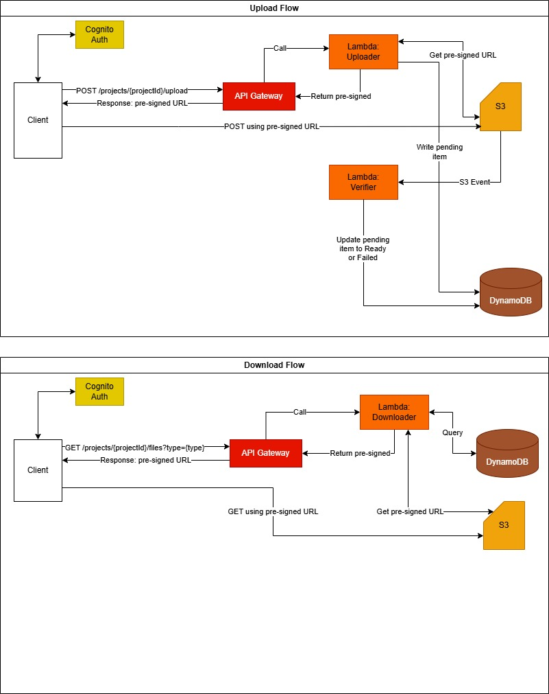

# Spacial - Project-Aware File Repository

A full-stack serverless application for managing and viewing project files, consisting of an AWS-based backend and an interactive 2D plan viewer frontend.

## 📁 Project Structure

This repository contains two main components:

### [back-end/](back-end/)

A serverless file repository API built with NestJS and deployed on AWS Lambda. Provides secure file upload/download capabilities with project-based access control.

**Key Features:**
- JWT authentication via Amazon Cognito
- Pre-signed URL generation for direct S3 uploads/downloads
- Asynchronous file verification via Lambda triggers
- Project-scoped file organization
- Encrypted storage with AWS KMS
- CloudFront CDN for optimized file delivery

**Technology Stack:**
- NestJS framework on AWS Lambda
- Amazon S3 for object storage
- Amazon DynamoDB for metadata
- Amazon Cognito for authentication
- CloudFront + WAF for security and delivery
- Terraform for infrastructure as code

**Documentation:**
- [Backend README](back-end/README.md) - Detailed backend documentation and API reference
- [Architecture Guide](back-end/Architecture.md) - Comprehensive architecture specification
- [Architecture Diagram](back-end/Architecture.drawio) - Visual architecture diagram (draw.io format)
- [Quick Start Guide](back-end/QUICKSTART.md) - Setup and deployment instructions



### [front-end/](front-end/)

An interactive 2D plan viewer application with zoom, pan, and real-time action logging. Demonstrates modern React patterns and state management.

**Key Features:**
- Interactive zoom and pan controls
- Cursor-fixed zooming with mouse wheel
- Real-time action logging with timestamps
- Responsive and modern UI design
- Type-safe TypeScript implementation

**Technology Stack:**
- React 19.2.0 with TypeScript
- Vite for fast development and builds
- SCSS Modules for scoped styling
- React Context API for state management
- ESLint for code quality

**Documentation:**
- [Frontend README](front-end/README.md) - Overview and features
- [Architecture Guide](front-end/Architecture.md) - Detailed technical architecture
- [Quick Start Guide](front-end/QUICKSTART.md) - Setup and usage instructions

## 🚀 Getting Started

### Prerequisites

- Node.js 20.x or later
- AWS Account with Administrator access (for backend)
- AWS CLI configured with credentials (for backend)
- Terraform 1.0 or later (for backend infrastructure)

### Backend Setup

Navigate to the backend folder and follow the [Quick Start Guide](back-end/QUICKSTART.md):

```bash
cd back-end
npm install
# Follow the Quick Start Guide for AWS infrastructure deployment
```

### Frontend Setup

Navigate to the frontend folder:

```bash
cd front-end
npm install
npm run dev
```

The application will be available at `http://localhost:5173`

## 📚 Additional Resources

- **Backend Architecture:** See [Architecture.md](back-end/Architecture.md) for detailed system design
- **Infrastructure:** Terraform configurations are located in [back-end/terraform/](back-end/terraform/)
- **Deployment Scripts:** Automated deployment scripts in [back-end/scripts/](back-end/scripts/)

## 🏗️ Architecture Overview

The application follows a modern serverless architecture:

### System Components

1. **Frontend** - React SPA hosted separately, communicates with backend API
2. **API Layer** - Amazon API Gateway with Cognito authorization
3. **Compute** - NestJS application running on AWS Lambda
4. **Storage** - S3 for files, DynamoDB for metadata
5. **Security** - KMS encryption, WAF protection, Cognito authentication
6. **Delivery** - CloudFront CDN for optimized content delivery

### Upload Flow

1. Client authenticates via **Cognito** and receives JWT token
2. Client calls `POST /projects/{projectId}/upload` via **API Gateway**
3. **Lambda Uploader** validates project access and generates S3 pre-signed URL
4. **DynamoDB** stores pending file metadata
5. Client uploads directly to **S3** using pre-signed URL
6. S3 event triggers **Lambda Verifier** for file validation
7. Verifier updates file status to Ready or Failed in **DynamoDB**

### Download Flow

1. Client authenticates via **Cognito**
2. Client calls `GET /projects/{projectId}/files?type={type}` via **API Gateway**
3. **Lambda Downloader** queries **DynamoDB** for file metadata
4. Downloader generates S3 pre-signed URL for authorized files
5. Client downloads directly from **S3** using pre-signed URL

## 📝 License

This project is part of a technical interview demonstration.


